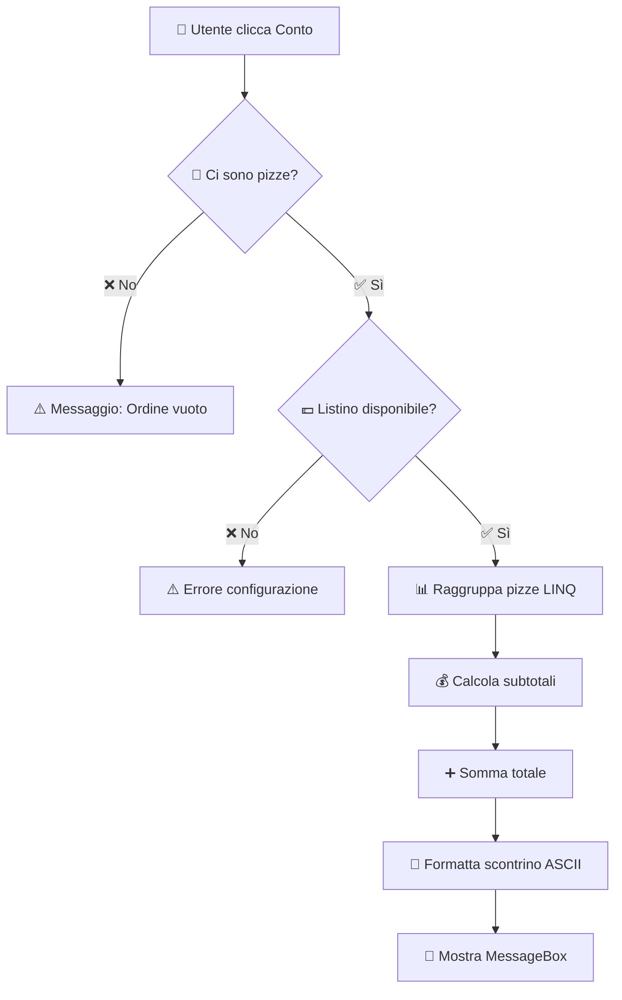

# 🧾 Funzione `MostraScontrino_Click`

## 📋 Informazioni Generali

| Campo | Valore |
|-------|--------|
| **📁 File** | `MostraScontrino_Function.txt` |
| **👥 Autori** | Ardente, Taramelli |
| **🎓 Classe** | 5^Ci |
| **📅 Anno Scolastico** | 2025/26 |
| **🔢 Versione** | 1.1 |

---

## 🎯 Descrizione Generale

Questa funzione **calcola il totale dell'ordine corrente** e genera uno **scontrino fiscale formattato** che viene visualizzato a video tramite una MessageBox.

### 📝 Contenuto dello scontrino

Lo scontrino include:
- 🏪 **Intestazione** con nome pizzeria (Ardente-Taramelli)
- 📅 **Data e ora** corrente
- 🔢 **Numero progressivo** dell'ordine
- 🍕 **Dettaglio delle pizze** raggruppate per tipo con quantità
- 💶 **Prezzo unitario** e subtotale per ogni tipo di pizza
- 💰 **Totale complessivo** dell'ordine
- 😊 **Messaggio di ringraziamento**

---

## 💡 A Cosa Serve

La funzione è fondamentale per:

1. 👁️ **Permettere al cliente** di visualizzare il conto prima del pagamento
2. 📊 **Fornire un riepilogo dettagliato** dell'ordine
3. 🧮 **Calcolare automaticamente** il totale basandosi sul listino prezzi
4. 📦 **Raggruppare pizze uguali** per una lettura più chiara
5. 🆔 **Generare un documento fiscale** con ID univoco per tracciabilità

---

## ⚙️ Come Funziona



### 🔄 Flusso operativo

1. ✅ Verifica che ci siano pizze nell'ordine
2. 🔍 Verifica che il listino prezzi sia disponibile
3. 📊 Raggruppa le pizze per tipo usando LINQ
4. 💰 Per ogni gruppo calcola: `quantità × prezzo unitario = subtotale`
5. ➕ Somma tutti i subtotali per ottenere il totale
6. 🎨 Formatta lo scontrino con caratteri ASCII art
7. 📱 Visualizza lo scontrino in una MessageBox

---

## 🛡️ Controlli Eseguiti

| # | Controllo | Descrizione |
|---|-----------|-------------|
| ✅ 1 | **Inizializzazione** | Verifica inizializzazione controllo `Ordini_Lista` |
| ✅ 2 | **Ordine vuoto** | Verifica presenza almeno una pizza nell'ordine |
| ✅ 3 | **Listino prezzi** | Verifica disponibilità listino prezzi |
| ✅ 4 | **Elementi validi** | Filtraggio elementi nulli o vuoti dalla lista |
| ✅ 5 | **Prezzi mancanti** | Gestione prezzi mancanti (usa prezzo default € 6,00) |
| ✅ 6 | **Eccezioni** | Gestione eccezioni durante l'elaborazione |

---

## 🔌 Collegamento al Form

### Metodo 1: Nel costruttore
```csharp
// Nel costruttore Form1()
this.Conto_Button.Click += new System.EventHandler(this.MostraScontrino_Click);
```

### Metodo 2: Direttamente nel codice
```csharp
Conto_Button.Click += MostraScontrino_Click;
```

---

## 🧪 Test di Sistema Correlati

| Test | Descrizione |
|------|-------------|
| **TEST 13** | ❌ Scontrino Ordine Vuoto |
| **TEST 14** | ✅ Scontrino Con Ordine Valido |
| **TEST 15** | ⚠️ Scontrino Prezzi Non Configurati |
| **TEST 16** | 📊 Scontrino Raggruppamento Pizze |
| **TEST 17** | 💰 Scontrino Calcolo Totale |
| **TEST 18** | 🆔 Scontrino ID Ordine |
| **TEST 25** | 🔒 Scontrino Tavolo Occupato |

---

## 🧰 Metodi per Test Automatizzati

### `GeneraScontrinoPerTest()`
```csharp
public (bool success, decimal totale, string dettaglio) GeneraScontrinoPerTest()
```

**Descrizione:**
- 🧪 Genera lo scontrino senza visualizzazione grafica
- 🎯 Utile per Unit Test
- 🚫 Non mostra MessageBox

**Ritorna una tupla con:**
- `success` (bool): `true` se la generazione è riuscita
- `totale` (decimal): Importo totale calcolato
- `dettaglio` (string): Stringa con il dettaglio dello scontrino

**Esempio di utilizzo:**
```csharp
var (success, totale, dettaglio) = GeneraScontrinoPerTest();

if (success)
{
    Console.WriteLine($"Totale: €{totale:F2}");
    Console.WriteLine(dettaglio);
}
```

---

## 💻 Codice Sorgente

```csharp
private void MostraScontrino_Click(object sender, EventArgs e)
{
    // CONTROLLO 1: Verifica inizializzazione
    if (Ordini_Lista == null)
    {
        MessageBox.Show(
            "⚠️ Errore di inizializzazione del controllo ordini.\n\n" +
            "🔄 Riavviare l'applicazione.",
            "❌ Errore Sistema",
            MessageBoxButtons.OK,
            MessageBoxIcon.Error
        );
        return;
    }

    // CONTROLLO 2: Verifica ordine non vuoto
    if (Ordini_Lista.Items.Count == 0)
    {
        MessageBox.Show(
            "📋 Nessun ordine presente per calcolare il conto.\n\n" +
            "🍕 Aggiungi almeno una pizza all'ordine prima di richiedere lo scontrino.",
            "⚠️ Ordine Vuoto",
            MessageBoxButtons.OK,
            MessageBoxIcon.Warning
        );
        return;
    }

    // CONTROLLO 3: Verifica listino prezzi
    if (listinoPrezzi == null || listinoPrezzi.Count == 0)
    {
        MessageBox.Show(
            "⚠️ Errore: Listino prezzi non disponibile.\n\n" +
            "📞 Contattare l'amministratore del sistema.",
            "❌ Errore Configurazione",
            MessageBoxButtons.OK,
            MessageBoxIcon.Error
        );
        return;
    }

    try
    {
        decimal totale = 0m;
        StringBuilder sb = new StringBuilder();

        // INTESTAZIONE SCONTRINO
        sb.AppendLine("╔══════════════════════════════════════╗");
        sb.AppendLine("║    🍕 PIZZERIA ARDENTE-TARAMELLI 🍕    ║");
        sb.AppendLine("║           5^Ci - 2025/26              ║");
        sb.AppendLine("╠══════════════════════════════════════╣");
        sb.AppendLine($"║  📅 Data: {DateTime.Now:dd/MM/yyyy}                   ║");
        sb.AppendLine($"║  🕐 Ora:  {DateTime.Now:HH:mm:ss}                      ║");
        sb.AppendLine($"║  🔢 Ordine N.: {idOrdineProgressivo.ToString().PadLeft(4, '0')}                 ║");
        sb.AppendLine("╠══════════════════════════════════════╣");
        sb.AppendLine("║  QTÀ   DESCRIZIONE          IMPORTO  ║");
        sb.AppendLine("╠══════════════════════════════════════╣");

        // CONTROLLO 4: Filtra elementi validi
        var listaPizze = Ordini_Lista.Items
            .Cast<object>()
            .Where(item => item != null)
            .Select(item => item.ToString())
            .Where(s => !string.IsNullOrWhiteSpace(s));

        if (!listaPizze.Any())
        {
            MessageBox.Show(
                "⚠️ L'ordine contiene solo elementi non validi.\n\n" +
                "🗑️ Svuota l'ordine e riprova.",
                "❌ Ordine Non Valido",
                MessageBoxButtons.OK,
                MessageBoxIcon.Warning
            );
            return;
        }

        // Raggruppa pizze per tipo
        var pizzeRaggruppate = listaPizze.GroupBy(p => p);

        // ELABORAZIONE RIGHE SCONTRINO
        foreach (var gruppo in pizzeRaggruppate)
        {
            string nomePizza = gruppo.Key;
            int quantita = gruppo.Count();

            // CONTROLLO 5: Gestione prezzo mancante
            decimal prezzoUnitario;
            if (listinoPrezzi.ContainsKey(nomePizza))
            {
                prezzoUnitario = listinoPrezzi[nomePizza];
            }
            else
            {
                // Prezzo predefinito per pizze non configurate
                prezzoUnitario = 6.00m;

                System.Diagnostics.Debug.WriteLine(
                    $"[WARNING] Prezzo non trovato per '{nomePizza}'. Applicato prezzo default: € 6,00"
                );
            }

            // Calcolo subtotale riga
            decimal subtotaleRiga = prezzoUnitario * quantita;
            totale += subtotaleRiga;

            // Formattazione riga scontrino
            string rigaFormattata = $"║  {quantita}x   {nomePizza.PadRight(18)} € {subtotaleRiga,7:F2} ║";
            sb.AppendLine(rigaFormattata);
        }

        // FOOTER SCONTRINO CON TOTALE
        sb.AppendLine("╠══════════════════════════════════════╣");
        sb.AppendLine($"║  💰 TOTALE ORDINE:          € {totale,7:F2} ║");
        sb.AppendLine("╠══════════════════════════════════════╣");
        sb.AppendLine("║                                      ║");
        sb.AppendLine("║     😊 Grazie per averci scelto! 😊    ║");
        sb.AppendLine("║        Ardente & Taramelli           ║");
        sb.AppendLine("║            5^Ci - 2025/26            ║");
        sb.AppendLine("╚══════════════════════════════════════╝");

        // VISUALIZZAZIONE SCONTRINO
        MessageBox.Show(
            sb.ToString(),
            $"🧾 Scontrino Fiscale - Ordine #{idOrdineProgressivo:0000}",
            MessageBoxButtons.OK,
            MessageBoxIcon.Information
        );
    }
    catch (InvalidCastException ex)
    {
        // CONTROLLO 6: Gestione errori di cast
        MessageBox.Show(
            $"⚠️ Errore durante l'elaborazione degli elementi dell'ordine:\n\n" +
            $"❌ {ex.Message}\n\n" +
            "ℹ️ Alcuni elementi potrebbero non essere nel formato corretto.",
            "❌ Errore Elaborazione",
            MessageBoxButtons.OK,
            MessageBoxIcon.Error
        );
    }
    catch (Exception ex)
    {
        MessageBox.Show(
            $"⚠️ Si è verificato un errore imprevisto durante la generazione dello scontrino:\n\n" +
            $"❌ {ex.Message}\n\n" +
            "📞 Contattare l'assistenza tecnica.",
            "❌ Errore Scontrino",
            MessageBoxButtons.OK,
            MessageBoxIcon.Error
        );
    }
}
```

---

## 📄 Esempio di Output Scontrino

```
╔══════════════════════════════════════╗
║    🍕 PIZZERIA ARDENTE-TARAMELLI 🍕    ║
║           5^Ci - 2025/26              ║
╠══════════════════════════════════════╣
║  📅 Data: 15/01/2026                   ║
║  🕐 Ora:  14:30:25                      ║
║  🔢 Ordine N.: 0001                 ║
╠══════════════════════════════════════╣
║  QTÀ   DESCRIZIONE          IMPORTO  ║
╠══════════════════════════════════════╣
║  2x   Margherita           €   10.00 ║
║  1x   Capricciosa          €    8.00 ║
║  1x   Quattro formaggi     €    8.50 ║
╠══════════════════════════════════════╣
║  💰 TOTALE ORDINE:          €   26.50 ║
╠══════════════════════════════════════╣
║                                      ║
║     😊 Grazie per averci scelto! 😊    ║
║        Ardente & Taramelli           ║
║            5^Ci - 2025/26            ║
╚══════════════════════════════════════╝
```

---

## 📊 Logica di Calcolo

### Formula del Subtotale
```
Subtotale = Quantità × Prezzo Unitario
```

### Formula del Totale
```
Totale = Σ (Subtotale di ogni tipo di pizza)
```

### Esempio pratico

| Pizza | Quantità | Prezzo Unit. | Subtotale |
|-------|----------|--------------|-----------|
| 🍕 Margherita | 2 | € 5.00 | € 10.00 |
| 🍕 Capricciosa | 1 | € 8.00 | € 8.00 |
| 🍕 4 Formaggi | 1 | € 8.50 | € 8.50 |
| **TOTALE** | **4** | - | **€ 26.50** |

---

## 🔍 Gestione Prezzi Mancanti

Se una pizza **non è presente nel listino**, viene applicato un **prezzo default di € 6,00**.

```csharp
decimal prezzoUnitario;
if (listinoPrezzi.ContainsKey(nomePizza))
{
    prezzoUnitario = listinoPrezzi[nomePizza];
}
else
{
    // ⚠️ Prezzo predefinito
    prezzoUnitario = 6.00m;
    
    // 📝 Log per debug
    Debug.WriteLine($"[WARNING] Prezzo non trovato per '{nomePizza}'");
}
```

---

## 🎨 Caratteri ASCII Box-Drawing

Lo scontrino utilizza caratteri **Unicode Box-Drawing** per creare il bordo:

| Carattere | Codice | Uso |
|-----------|--------|-----|
| ╔ | U+2554 | Angolo alto sinistro |
| ╗ | U+2557 | Angolo alto destro |
| ╚ | U+255A | Angolo basso sinistro |
| ╝ | U+255D | Angolo basso destro |
| ║ | U+2551 | Bordo verticale |
| ═ | U+2550 | Bordo orizzontale |
| ╠ | U+2560 | T sinistra |
| ╣ | U+2563 | T destra |

---

## 🚨 Gestione Errori

### Errore 1: Ordine Vuoto
```
📋 Nessun ordine presente per calcolare il conto.

🍕 Aggiungi almeno una pizza all'ordine prima di richiedere lo scontrino.
```

### Errore 2: Listino Non Disponibile
```
⚠️ Errore: Listino prezzi non disponibile.

📞 Contattare l'amministratore del sistema.
```

### Errore 3: Elementi Non Validi
```
⚠️ L'ordine contiene solo elementi non validi.

🗑️ Svuota l'ordine e riprova.
```

---

## 🔄 Integrazione con Altri Componenti

### Dipendenze
- `Ordini_Lista` (ListBox): contiene le pizze ordinate
- `listinoPrezzi` (Dictionary): mappa pizza → prezzo
- `idOrdineProgressivo` (int): numero progressivo dell'ordine

### Componenti correlati
- 🍕 `AggiungiPizza()`: aggiunge pizze all'ordine
- 💾 `SalvaStorico()`: salva l'ordine su file
- 🗑️ `SvuotaOrdine()`: pulisce l'ordine corrente

---

## 👥 Credits

**Sviluppato da:** Ardente & Taramelli  
**Classe:** 5^Ci  
**Anno Scolastico:** 2025/26  
**Versione:** 1.1

---

> 💡 **Nota:** Questa funzione fa parte del sistema gestionale per pizzerie sviluppato come progetto scolastico. Lo scontrino generato è a scopo dimostrativo e non ha valore fiscale legale.
