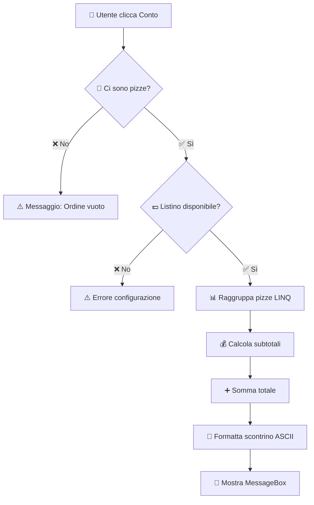

# 🧾 Funzione `MostraScontrino_Click`

**Branch:** `feature/MostraScontrino` | **Stato:** ✅ Completato

---

Questa funzione **calcola il totale dell'ordine corrente** e genera uno **scontrino fiscale formattato** che viene visualizzato a video tramite una MessageBox.

---

## 🚀 Cosa fa questa funzione?

Quando l'utente clicca su **"Mostra Conto"**, il sistema genera uno scontrino completo con:

- 🏪 Intestazione pizzeria (Ardente-Taramelli)
- 📅 Data e ora corrente
- 🔢 Numero progressivo ordine
- 🍕 Dettaglio pizze raggruppate per tipo
- 💶 Prezzi unitari e subtotali
- 💰 Totale complessivo
- 😊 Messaggio di ringraziamento

---

## ✨ Punti di Forza

- 📊 **Raggruppamento LINQ**: Unisce pizze identiche (es. `3x Margherita` invece di 3 righe separate)
- 🧮 **Calcolo automatico**: Totale basato sul listino prezzi configurato
- 🎨 **Formato ASCII art**: Scontrino professionale e leggibile
- ✅ **Validazione completa**: Controlla ordine vuoto e listino prezzi
- 🆔 **Tracciabilità**: Ogni scontrino ha un ID univoco progressivo

---

## ⚙️ Logica di Funzionamento

Il flusso garantisce l'**integrità dei dati** prima della visualizzazione:


---

## 📄 Esempio Output

Lo scontrino generato è ottimizzato per la **leggibilità**:
```text
╔═══════════════════════════════════════════╗
║       🍕 PIZZERIA ARDENTE-TARAMELLI       ║
╚═══════════════════════════════════════════╝

📅 Data: 11/12/2025 14:30:15
🔢 Ordine N°: 00042

─────────────────────────────────────────────

🍕 Margherita              x 2
   € 6.50 cad.                    € 13.00

🍕 Diavola                 x 1
   € 7.50 cad.                    €  7.50

🍕 Quattro Formaggi        x 3
   € 8.00 cad.                    € 24.00

─────────────────────────────────────────────

💰 TOTALE:                        € 44.50

═════════════════════════════════════════════
        Grazie per la vostra fiducia! 😊
═════════════════════════════════════════════
```

---

## 🛠️ Dettagli Tecnici

- **Tecnologia**: LINQ per aggregazione dati
- **UI**: Windows Forms MessageBox
- **Formato Data**: `dd/MM/yyyy HH:mm:ss`
- **Gestione Errori**: Validazione ordine vuoto e listino prezzi mancante
- **Output**: Scontrino ASCII art formattato

---

## 🧪 Matrice dei Test

| ID | Scenario | Input | Output Atteso | Risultato |
|----|----------|-------|---------------|-----------|
| T01 | Ordine standard | 2x Margherita, 1x Diavola | Totale € 20.50 | ✅ Pass |
| T02 | Ordine vuoto | Nessuna pizza | Warning "Ordine vuoto" | ✅ Pass |
| T03 | Listino mancante | 1x Pizza, listino null | Errore configurazione | ✅ Pass |
| T04 | Raggruppamento | 3x Margherita separate | `3x Margherita` in 1 riga | ✅ Pass |

---

## 🔜 Sviluppi Futuri

- [ ] 🖨️ **Stampa fisica** dello scontrino
- [ ] 💾 **Salvataggio automatico** post-visualizzazione
- [ ] 📧 **Invio email** al cliente
- [ ] 📱 **Interfaccia grafica** dedicata
- [ ] 📊 **Export PDF**

---

<div align="center">

**Sviluppato da:** Ardente & Taramelli (5^Ci)  
📅 **Anno Scolastico 2025/26**

</div>
