# 💾 Feature: Storico Ordini Persistente

**Branch:** `feature/salva-storico` | **Stato:** ✅ Completato

---

Questa branch introduce la funzionalità critica di **salvataggio permanente degli ordini**. Permette alla pizzeria di mantenere un registro indelebile di tutte le transazioni su file locale, garantendo sicurezza dei dati e tracciabilità.

---

## 🚀 Cosa fa questa feature?

Quando l'utente clicca su **"Salva Storico"**, il sistema esegue una **"fotografia"** dell'ordine attuale e la archivia in modo sicuro.

---

## ✨ Punti di Forza

- 📝 **Modalità Append**: Scrive in coda al file `StoricoOrdini.txt` senza mai sovrascrivere i dati passati.
- 🧠 **Smart Grouping**: Usa LINQ per raggruppare le pizze identiche (es. scrive `2x Margherita` invece di ripeterla due volte).
- 🛡️ **Crash-Proof**: Sistema di gestione errori avanzato (file in uso, percorsi errati, permessi negati).
- 🔒 **Validazione**: Impedisce il salvataggio di ordini vuoti o nulli.

---

## ⚙️ Logica di Funzionamento

Il flusso è progettato per garantire l'**integrità dei dati** prima della scrittura:

```mermaid
graph LR
    A[🖱️ Click] --> B{🍕 Ordine Valido?}
    B -->|✅ Sì| C{📂 File Accessibile?}
    C -->|✅ Sì| D[📊 Raggruppa Dati]
    D -->|💾| E[Scrittura su .txt]
    B & C -->|❌ No| F[⚠️ Feedback Utente]
```


---

## 📄 Esempio Output

Il file generato è ottimizzato per la **leggibilità umana** e per **future analisi dati**.
```text
ID: 0001 | DATA: 15/01/2026 14:30:25 | ORDINE: 2x Margherita, 1x Capricciosa
ID: 0002 | DATA: 15/01/2026 15:45:12 | ORDINE: 1x Marinara, 3x Quattro formaggi
ID: 0003 | DATA: 15/01/2026 16:20:08 | ORDINE: 1x Salmone
```

---

## 🛠️ Dettagli Tecnici

- **File Target**: `AppDomain.BaseDirectory/StoricoOrdini.txt`
- **Gestione Errori**: Try/Catch specifici per `IOException`, `UnauthorizedAccessException`, `PathTooLongException`.
- **Feedback**: MessageBox informative con icone differenziate (Info/Warning/Error).

---

<div align="center">

**Sviluppato da:** Ardente & Taramelli (5^Ci)  
📅 **Anno Scolastico 2025/26**

</div>
